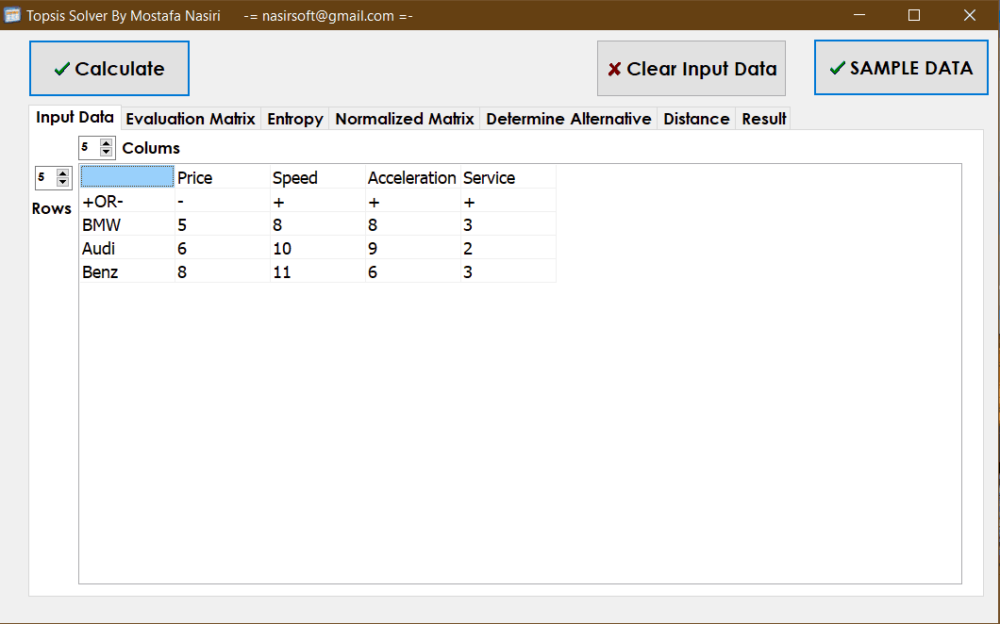

# TOPSIS-calculator
A program with a simple graphical user interface and step-by-step display of calculations.

_The Technique for Order Preference by Similarity to Ideal Solution (TOPSIS) method determines the best solution from a set of alternatives with certain attributes. The best alternative is chosen based on its Euclidean distance from the ideal solution. TOPSIS is widely used in various multi-attribute decision making problems such as supply chain logistics, marketing management, environmental management or chemical engineering._

